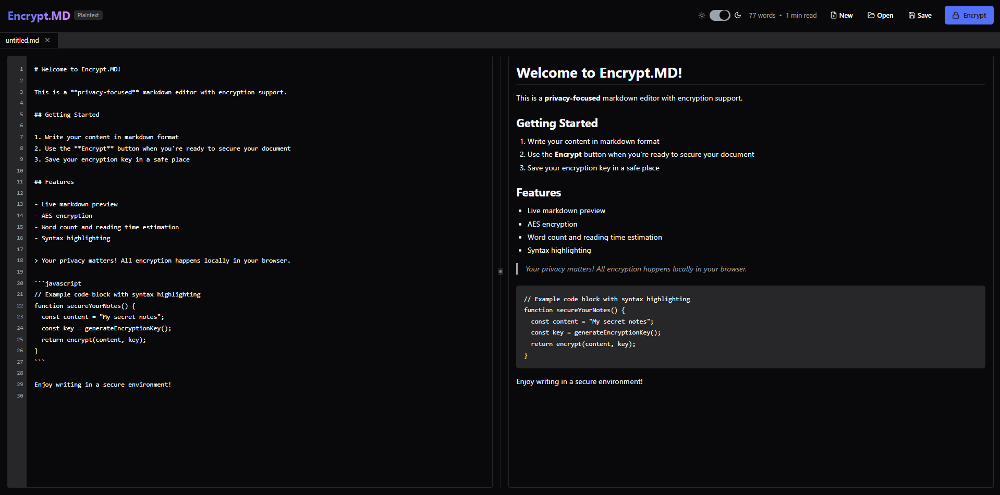

# Encrypt.MD

**Encrypt.MD** is a privacy-focused markdown editor with built-in AES encryption. It features a clean, intuitive interface for writing and encrypting markdown documents, allowing you to securely store sensitive notes directly in your browser.



## Features

* **Live Markdown Editing & Preview** – Write in markdown with real-time rendering
* **AES Encryption** – Secure documents using strong AES encryption
* **Tabbed Interface** – Work with multiple documents at once
* **Syntax Highlighting** – Automatic highlighting for code blocks
* **Document Stats** – Built-in word count and reading time
* **Client-Side Encryption** – All data stays on your device; nothing is sent to any server
* **Keyboard Shortcuts** – Includes useful shortcuts like Ctrl+S for saving

## Getting Started

### Installation

Clone the repository and set up the development environment:

```bash
# Clone the repository
git clone https://github.com/nextcodeworks/encrypt-md.git

# Navigate into the project directory
cd encrypt-md

# Install dependencies
npm install

# Start the development server
npm run dev
```

### Usage

1. **Create a New Document**

   * Click "New File" on the welcome screen or use the toolbar
   * Start writing in the editor; the preview updates in real time

2. **Open an Existing Document**

   * Click "Open File" or use the toolbar
   * Choose a `.md` or encrypted `.mdlock` file

3. **Save a Document**

   * Click the Save button or press Ctrl+S (Cmd+S on Mac)
   * Select a location to save the file

4. **Encrypt a Document**

   * Click the Encrypt button in the toolbar
   * A unique encryption key will be generated
   * Save this key securely—you’ll need it to decrypt the file
   * The encrypted document can be saved as a `.mdlock` file

5. **Decrypt a Document**

   * Open an encrypted `.mdlock` file
   * Enter your encryption key when prompted
   * Once decrypted, you can edit the document as usual

## Security

Encrypt.MD uses AES encryption powered by the **CryptoJS** library. All encryption and decryption is done locally in your browser. Your data, including encryption keys, never leaves your device.

## Technical Details

* Built with **React**, **TypeScript**, and **Vite**
* Uses:

  * [CryptoJS](https://cryptojs.gitbook.io/docs/) – for encryption
  * [Marked](https://marked.js.org/) – for markdown parsing
  * [Highlight.js](https://highlightjs.org/) – for syntax highlighting
  * [DOMPurify](https://github.com/cure53/DOMPurify) – for HTML sanitization

## Development

### Prerequisites

* Node.js (v16 or newer)
* npm or yarn

### Development Commands

```bash
# Install dependencies
npm install

# Start the development server
npm run dev

# Build the app for production
npm run build

# Preview the production build
npm run preview
```

## Contributing

Contributions are welcome! To contribute:

1. Fork the repository
2. Create a new branch: `git checkout -b feature/your-feature-name`
3. Commit your changes: `git commit -m "Add your feature"`
4. Push the branch: `git push origin feature/your-feature-name`
5. Open a pull request

## License

This project is licensed under the **MIT License** – see the [LICENSE](LICENSE) file for details.
